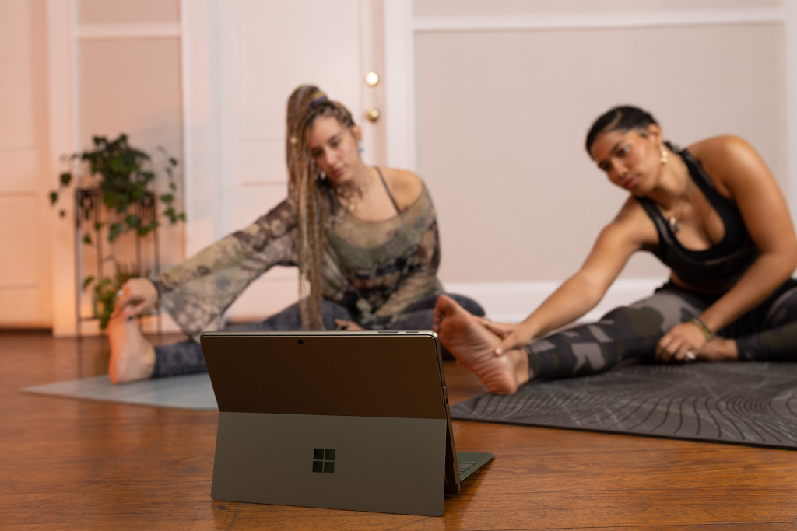

# Website for Storytelling

This is a simple web page that tells exciting stories. It has different sections where you can learn about interesting things related to technology. Let's take a look at what's on this page:

## Navigation Bar

At the top of the page, there's a special bar called the navigation bar. It's like a map that helps you find your way around the website. It has two things:

- **Title:** The big writing that says "This is where we tell stories." It's like a sign telling you that you're in a cool place to learn new things.

- **Button:** A button called "Contact Us." It's like a doorbell you can press if you want to ask questions or talk to someone.

## Blog Posts

Below the navigation bar, there are lots of rectangles with pictures and words. Each rectangle is called a "blog post." Here's what they are:

### The Remarkable Benefits of Learning a Tech Skill

This story is about how cool it is to learn things about technology. You can learn about computers, apps, and more! Learning these things can help you do amazing stuff and have fun.

### The Many Benefits of Being a Web Developer

This story talks about being a "web developer." That's someone who makes websites. It's like building a house on the internet! You can learn to make beautiful websites and explore the online world.

### The Relaxation Benefits of Being a Developer

Being a "developer" means you can make computer things. But guess what? It's also a way to feel relaxed and calm. This story shows you how playing with computers can be a peaceful adventure.

### The Power of Hardware Repair and Maintenance

This story is about fixing and taking care of computer parts. It's like fixing toys, but with technology. Learning this helps you keep things working well and helps the Earth by not wasting stuff.

### Discovering Your Path: Navigating the Tech Industry

If you're curious about tech (that's short for technology), this story can guide you. It's like a treasure map to help you find where you want to go in the world of tech. There are many paths you can explore!

### Unveiling Cybersecurity: The Art of Penetration Testing

Ever heard of "cybersecurity"? It's like being a digital detective to protect computers. This story is about a special kind of detective work called "penetration testing." It's like finding hidden doors to keep the online world safe.

So, that's what this webpage is all about! You can click on the different blog posts to read exciting stories about technology. It's like going on a fun adventure through the digital world!

# HTML Instructions
**Step 1: Set Up the Basic Structure**

1. Open a text editor (like Notepad, Visual Studio Code, or Sublime Text).
2. Start by typing `<!DOCTYPE html>` to indicate that you're using HTML5.
3. Enter the opening `<html>` tag.
4. Inside the `<html>` tag, add the `<head>` section and include necessary metadata like the character set and viewport.
5. Inside the `<head>` section, set the title of the page using the `<title>` tag.
6. Link an external stylesheet by adding `<link rel="stylesheet" href="./style.css">`.
7. Close the `<head>` section.

**Step 2: Build the Content**

8. Start the `<body>` section.
9. Create a navigation bar using the `<nav>` tag.
10. Inside the `<nav>`, add an `<h1>` heading for the website's title.
11. Include a button using the `<button>` tag for the "Contact Us" button.

**Step 3: Add Blog Posts**

12. Create a `
` with a class of "blogPosts" to hold the blog post sections.
13. For each blog post, create an `<a>` tag with an `href` attribute pointing to the respective post's HTML file.
14. Inside each `<a>`, create a `
` with a class of "postCard" to style each blog post card.
15. Insert an `` tag with an `alt` attribute for the image related to the blog post.
16. Add a `
` with a class of "divider" to separate different parts of the card.
17. Include a `
` tag with a class of "title" for the title of the blog post.
18. Add another `
` with a class of "divider".
19. Insert a `` tag to write a brief description of the blog post.

**Step 4: Close the HTML Document**

20. Close the `
` for the blog posts.
21. Close the `<body>` section.
22. Close the `<html>` section.

**Step 5: Save the File**

23. Save the file with an `.html` extension (e.g., `index.html`).

Remember, HTML code is written using a simple text editor, and you can save the file with the `.html` extension to see how it looks in a web browser. Make sure to also have the necessary images and CSS file in the same directory as the HTML file for everything to work properly.

# Main CSS file
**Step 1: Create a New CSS File**

1. Open a text editor or a dedicated CSS editor.
2. Start by creating a new file and save it with a `.css` extension (e.g., `style.css`).

**Step 2: Set Global Styles**

3. Begin with a selector `*` to apply these styles to all elements on the page.
4. Inside the curly braces, set `box-sizing` to `border-box` to make sure padding and border are included in the element's total width and height.
5. Use `font-family` to specify the preferred font for text.
6. Set `margin` and `padding` to `0` to remove any default spacing around elements.

**Step 3: Style the Navigation Bar**

7. Target the `nav` element using the `nav` selector.
8. Set the `height` of the navigation bar using `12vh` (12% of the viewport height).
9. Use `display: flex` to create a flexible layout.
10. Use `justify-content: space-between` to spread items evenly along the horizontal axis.
11. Align items vertically at the center with `align-items: center`.
12. Add `padding` to the navigation bar's left and right sides using `padding: 0 10%`.
13. Create a bottom border with `border-bottom: 1px solid #000`.
14. Add a media query using `@media (max-width: 768px)` to adjust styles for smaller screens.
15. Inside the media query, adjust the padding to `padding: 0 5%`.

**Step 4: Style the Contact Button**

16. Target the `button` element inside the `nav` using `nav button` selector.
17. Set the `height` of the button to `3em`.
18. Add `padding` to the button's left and right sides using `padding: 0 1em`.
19. Remove the default border with `border: none`.
20. Set the background color to black with `background-color: black`.
21. Set the text color to white with `color: #fff`.

**Step 5: Style the Blog Posts Section**

22. Target the `.blogPosts` class.
23. Use `display: flex` to create a flexible layout for the blog posts.
24. Use `justify-content: space-between` to evenly space out items horizontally.
25. Align items to the top with `align-items: flex-start`.
26. Allow the items to wrap onto a new line using `flex-wrap: wrap`.
27. Add padding to the left and right sides using `padding: 0 10%`.
28. Create a space between the navigation bar and blog posts using `margin-top: 3em`.
29. Add a media query for screens smaller than 768px using `@media (max-width: 768px)`.
30. Inside the media query, adjust the flex direction to `flex-direction: column` to stack items vertically.
31. Adjust the padding to `padding: 0 5%`.

**Step 6: Style Blog Post Cards**

32. Target the anchor (`<a>`) element inside `.blogPosts` using `.blogPosts a` selector.
33. Remove the default text decoration with `text-decoration: none`.
34. Remove the outline that appears when clicking on the link with `outline: none`.
35. Set the text color to black with `color: #000`.
36. Set the width of each blog post to `32%` to evenly space them.
37. Add a bit of space between blog posts using `margin-bottom: 3em`.
38. Add a media query for screens smaller than 768px using `@media (max-width: 768px)`.
39. Inside the media query, adjust the width to `width: 100%` to make them take up the full width.

**Step 7: Style Post Card Content**

40. Target the `.postCard` class inside each anchor using `.blogPosts a .postCard` selector.
41. Set the width of the post card to `100%`.
42. Target the `` element inside `.postCard` using `.blogPosts a .postCard img`.
43. Set the width to `100%` to make the image fill the container.
44. Set the height to `200px` to control the image's height.
45. Use `object-fit` to make the image cover the container while maintaining its aspect ratio.
46. Target the `.divider` class inside `.postCard` using `.blogPosts a .postCard .divider` selector.
47. Set the height of the divider line to `1px`.
48. Set the background color to black using `background-color: #000`.
49. Add space above and below the divider using `margin: 1em 0`.
50. Target the `.title` class inside `.postCard` using `.blogPosts a .postCard .title`.
51. Increase the font size to `1.5em` with `font-size: 1.5em !important`.
52. Make the title bold with `font-weight: bold`.

**Step 8: Save the CSS File**

53. Save the CSS file once you've finished writing the code.

That's it! These steps will guide you through writing the provided CSS code. Remember to link the CSS file to your HTML document to see the styles take effect.

# Post page CSS Instructions
**Step 1: Create a New CSS File**

1. Open a text editor or a dedicated CSS editor.
2. Start by creating a new file and save it with a `.css` extension (e.g., `style.css`).

**Step 2: Set Global Styles**

3. Begin with a selector `*` to apply these styles to all elements on the page.
4. Inside the curly braces, set `box-sizing` to `border-box` to ensure padding and border are included in the element's total width and height.
5. Use `font-family` to specify the preferred font for text.
6. Set `margin` and `padding` to `0` to remove any default spacing around elements.

**Step 3: Style the Navigation Bar**

7. Target the `nav` element using the `nav` selector.
8. Set the `height` of the navigation bar using `12vh` (12% of the viewport height).
9. Use `display: flex` to create a flexible layout.
10. Use `justify-content: space-between` to spread items evenly along the horizontal axis.
11. Align items vertically at the center with `align-items: center`.
12. Add `padding` to the navigation bar's left and right sides using `padding: 0 10%`.
13. Create a bottom border with `border-bottom: 1px solid #000`.
14. Add a media query using `@media (max-width: 768px)` to adjust styles for smaller screens.
15. Inside the media query, adjust the padding to `padding: 0 5%`.

**Step 4: Style the Contact Button**

16. Target the `button` element inside the `nav` using `nav button` selector.
17. Set the `height` of the button to `3em`.
18. Add `padding` to the button's left and right sides using `padding: 0 1em`.
19. Remove the default border with `border: none`.
20. Set the background color to black with `background-color: black`.
21. Set the text color to white with `color: #fff`.

**Step 5: Style the Blog Post Content**

22. Target the `.post` class using `.post` selector.
23. Add space above the content using `margin-top: 3em`.
24. Add padding to the left and right sides using `padding: 0 10%`.
25. Add a media query for screens smaller than 768px using `@media (max-width: 768px)`.
26. Inside the media query, adjust the padding to `padding: 0 5%`.

**Step 6: Style Images**

27. Target images (``) inside the `.post` using `.post img` selector.
28. Set the width to `100%` to ensure images fit within their container.
29. Set the height to `auto` to maintain the image's aspect ratio.
30. Use `-o-object-fit` and `object-fit` properties to ensure images cover their container while maintaining aspect ratio.

**Step 7: Style Dividers**

31. Target the elements with the `.divider` class using `.post .divider` selector.
32. Set the height of the divider to `1px`.
33. Set the background color to black using `background-color: #000`.
34. Add space above and below the divider using `margin: 1em 0`.

**Step 8: Style Paragraphs**

35. Target paragraphs (`
`) inside the `.post` using `.post p` selector.
36. Set the font size to `1em`.
37. Add space at the bottom of paragraphs using `margin-bottom: 2em`.
38. Set a maximum width of `700px` to keep paragraphs readable.
39. Ensure paragraphs take the full width on smaller screens using `max-width: 100%`.

**Step 9: Style Ordered Lists**

40. Target ordered lists (`<ol>`) inside the `.post` using `.post ol` selector.
41. Set the font size to `1em`.
42. Set a maximum width of `700px` to keep lists readable.
43. Ensure list items have space below them using `margin-bottom: 1em`.

**Step 10: Save the CSS File**

44. Save the CSS file once you've finished writing the code.

That's it! Following these steps will help you create the styles described in the provided CSS code. Make sure to link the CSS file to your HTML document to see the styles take effect.